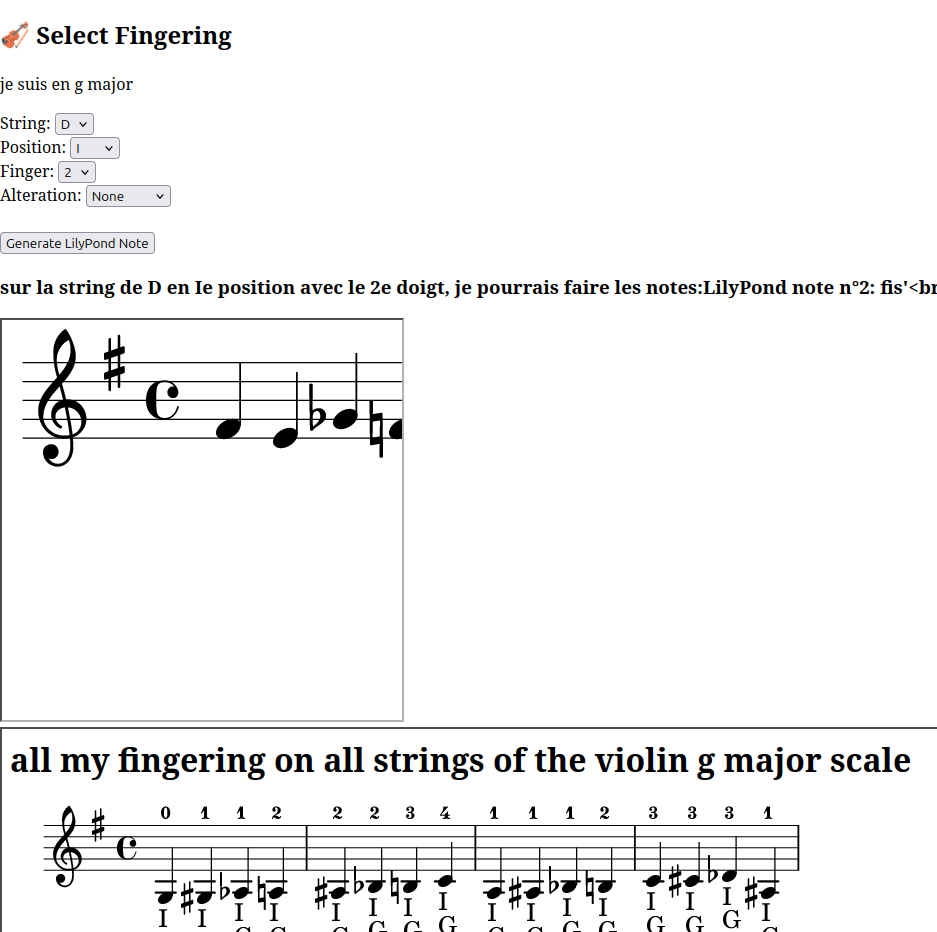
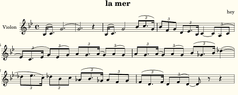
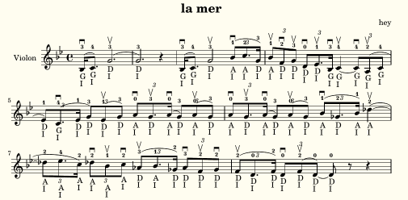
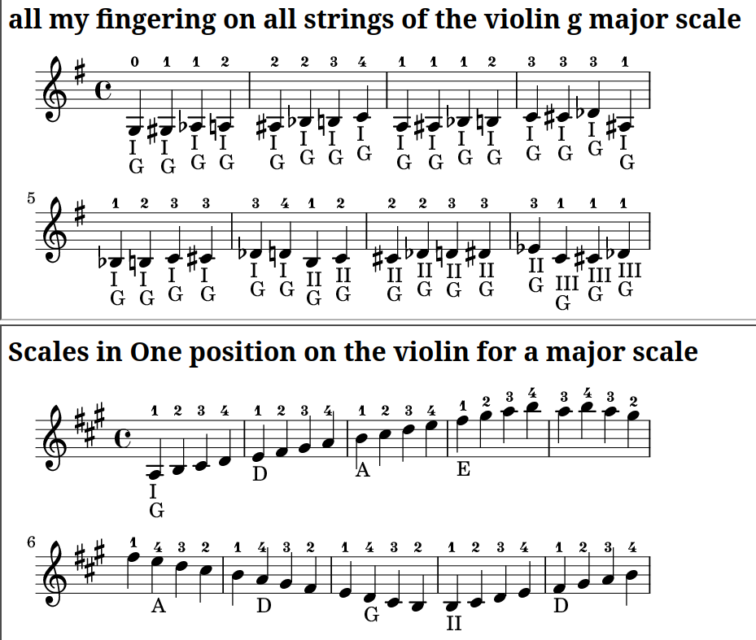

# Violin Annotation Workflow

- Have `pavanehey.ly` with slur notes and rhythms.

- Run:
  - `python3 slurdownupbow.py 0`  
    - Starts with downbow.
    - Adds alternating bowing marks (`^\downbow`, `^\upbow`).

- Open `pavanehey.ly` in Frescobaldi.

- Select the block that starts with `\relative c'' { ... }`.

- Go to Tools → Pitch → Absolute.

- Frescobaldi rewrites notes using absolute pitch notation.

- Save the result as `pavanehey_absolute.ly`.

- Run:
  - `python3 stringpositionfingering.py`  
    - Adds fingering (`^1`), string (`_"G"`), and position (`_"I"`).

- ✅ Fingering annotations inserted.  
  - Output saved to `violin_annotated.ly`.

# ghost-violin
- 🛠️ Instructions to Use:

 -    there's this script  annotate_violin.sh.

 -   Make it executable:
- chmod +x annotate_violin.sh

 -    bash
- ./annotate_violin.sh

python3 -m venv ~/path/to/venv.
 - source ~/path/to/venv/bin/activate.
### why aes8 becomes as8 and a8 becomes a,8
 - aes is a falat and as is ab , lilypond normalize aes to as
- in relative mode, a8 is a lower octave (A3) when converted, to absolute, it becomes, a,8
- Run:
  - `python3 mapviolinrefactored
  - if you want to editthe position, string, you must edit , say in the program change positoin only e string, 1st position , etc

 - python3 -m http.server
